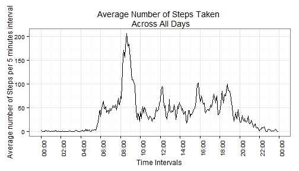
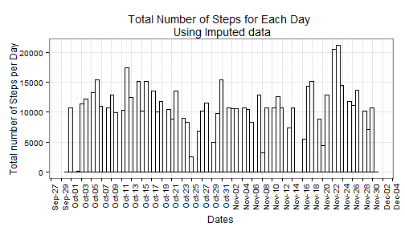
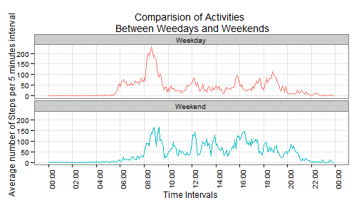

**Time series plot of the 5-minute interval (x-axis) and the average number of steps taken averaged across all days(y-axis)**  

*The data from activity file is grouped by each time interval across all days and summarised values for total, average, and median is calculated. The lable for x-axis is broken into 2 hours interval*  


```r
    bytime <- group_by(activityfile,time)
    bytime <- summarise(bytime,
                    total=as.numeric(sum(steps,na.rm=TRUE)),
                    average=mean(steps,na.rm=TRUE),midpoint=median(steps,na.rm=TRUE))
    ggplot(data=bytime, aes(x=time, y=average)) +
        geom_line() + labs(title=c("Average Number of Steps Taken \n Across All Days")) +
        scale_x_datetime(breaks = "2 hours", labels=date_format("%H:%M"))+
        ylab("Average number of Steps per 5 minutes interval")+
        xlab("Time Intervals")+
        theme_bw()+
        theme(axis.text.x = element_text(angle = 90, hjust = 1)) +
        theme(legend.position="none")
```

 

**Which 5-minute interval, on average across all the days in the dataset, contains the maximum number of steps?**  
*The time interval 835 i.e. 8:35 AM has the highest number of steps across all days.*  
*The activity data is grouped by each interval and summarised values of total, mean, and median number of steps is calculated for each step.*
*The interval with the maximum number of steps is reported at the bottom.*


```r
        byInterval <- group_by(activityfile,interval)
        byInterval <- summarise(byInterval,total=as.numeric(sum(steps,na.rm=TRUE)),
                        average=mean(steps,na.rm=TRUE),
                        midpoint=median(steps,na.rm=TRUE))

        byInterval[byInterval$total==max(byInterval$total),1]
```

```
## Source: local data frame [1 x 1]
## 
##   interval
## 1      835
```

###Imputing data  

**Device a strategy for filling in all the missing values in the dataset. The strategy does not need to be sophisticated. For example, you could use the mean/median for that day, or the mean for that 5-minute interval, etc.**   

*The strategy used is to replace the NA values in step variable by the average value of corresponding interval across all days. It is achived in following steps:*   

1.   *Create a dataframe "notok" with non complete cases i.e. all the rows with NA values*  

2.   *Create another dataframe "ok" with completed cases i.e. all the rows without NA values.*  

3.   *Create a datatable "dt1" from the dataframe "notok" (step1). Set the key to variable "interval".*  

4.   *Create a datatable "dt2" from the dataframe "byInterval" (from previous chunk). Set the key to variable "interval".*  
5.   *Merge tables dt1 and dt2 creating another table dt3.*  

6.   *Replace the NA values in variable steps by the values average.*  

7.   *Remove the unwanted variables in column 6, 7, and 8 so that the structure for dt3 matches with the structure of the dataframe Ok(the one with the non NA values).*  

8.   *Using rbind stack both the dataframes Ok and dt3 into a new dataframe "newactivityfile".*  

9.   *Sort the dataframe "newactivityfile" in date and interval ascending order.*

**Create a new dataset that is equal to the original dataset but with the missing data filled in.**  
**Prepare list of all the totals, average, and median by each interval.


```r
# data with all the rows with the NA values
    notok <- activityfile[!complete.cases(activityfile),]
# data with all the rows without the NA values
    ok <- activityfile[complete.cases(activityfile),]
# setting keys for dt1 (with NA values) and dt2 (table by intervals)
#  
    dt1<-data.table(notok,  key="interval") 
    dt2<-data.table(byInterval, key="interval")
    dt3<- merge(dt1, dt2)
# replacing the steps NA values by average of that particular interval
    dt3$steps <- dt3$average
# removing unwanted columns making it to the same structure as the table with
# data without NA values
    set( dt3, j=c(6L,7L,8L), value=NULL ) # remove columns
# Stacking the Table with the good rows with the table with modified values.
    newactivityfile <- rbind(ok,dt3)
# Sorting in date and interval order
    newactivityfile <- newactivityfile[order(date,interval),]
```
**Calculate and report the total number of missing values in the dataset(i.e the total number of rows with NAs)?**


```r
    nrow(dt1)
```

```
## [1] 2304
```

**Make a histogram of the total number of steps taken each day and Calculate and report the mean and median total number of steps taken per day. Do these values differ from the estimates from the first part of the assignment?**  
*Imputing impacted the data as overall averages became higher and number of zero activites are significantly less.*  

```r
    newbyDay <- group_by(newactivityfile,date)
    newbyDay <- data.frame(summarise(newbyDay,total=as.numeric(sum(steps)),average=mean(steps),midpoint=median(steps)))
# 
    ggplot(newbyDay, aes(x = date)) +
        geom_histogram(aes(weight = total),fill=NA,color="black", binwidth=0.75) +
        scale_x_date(breaks = "2 day",
               labels=date_format("%b-%d")) +
        labs(title="Total Number of Steps for Each Day \n Using Imputed data")+
        ylab("Total number of Steps per Day")+
        xlab("Dates")+
        theme_bw() + theme(axis.text.x = element_text(angle = 90, hjust = 1))
```

 


```r
    mean(newbyDay$total)
```

```
## [1] 10766.19
```

```r
    median(newbyDay$total)
```

```
## [1] 10766.19
```

**What is the impact of imputing the data?**  
*The average number of steps for all the days increased from 9354.23 to 10766.19.*  
*The median also increased from 10395 to 10766.19.*  

---

###Differences in activities pattern between Weekdays and weekends.  

**Make a panel plot containg a time series plot(i.e. type="I") of the 5-minute interval(x-axis) and the average number of steps taken, averaged across all weekday days or weekend days(y-axis).**  
*The main differences from the plot are visible as following:*  

-   *During the weekdays, the activities start earlier around 6:00 AM and peak after 8:00 AM. After the peak the activites start to slow down and remain below 100 steps on the average until 8:00 PM and it starts to come to rest.*  

-   *During the weekends, the activites start late around 8:00 AM and reached at it's peak twice within two hours. After that it ocillates between 150 and 50 steps until 9:00 PM. After that it slows to the rest.*  

```r
        newbytime <- group_by(newactivityfile,typeOfDay,time) 
        newbytime <- data.frame(summarise(newbytime,total=as.numeric(sum(steps)),average=mean(steps),midpoint      =median(steps)))
        ggplot(data=newbytime, aes(x=time, y=average, group=typeOfDay,color=typeOfDay)) +
        geom_line() + labs(title=c("Comparision of Activities \n Between Weedays and Weekends")) +
        scale_x_datetime(breaks = "2 hours", labels=date_format("%H:%M"))+
        facet_wrap(~typeOfDay, nrow=2) +
        ylab("Average number of Steps per 5 minutes interval")+
        xlab("Time Intervals")+
        theme_bw()+
        theme(axis.text.x = element_text(angle = 90, hjust = 1)) +
        theme(legend.position="none")
```

 
